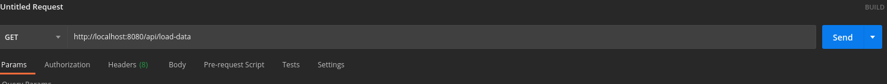
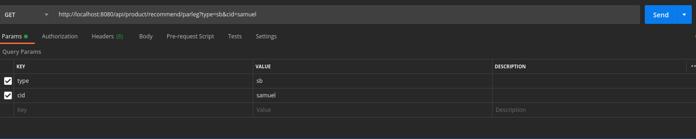
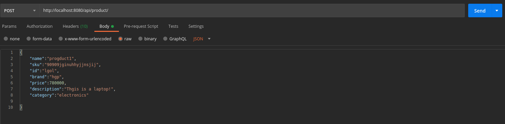
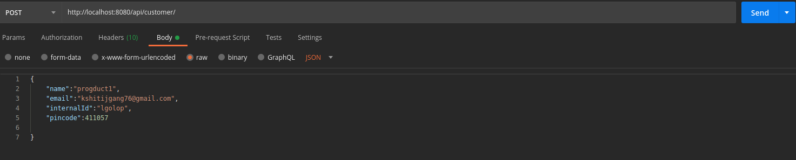
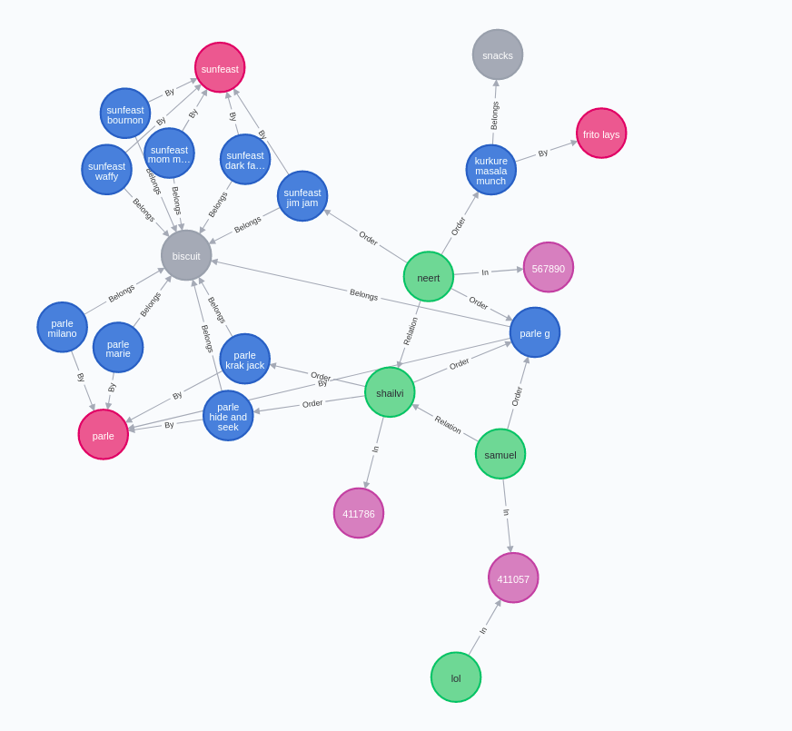

# store-recommendation
basic product recommendation backend made using golang and neo4j

To load test data:

To get recommendations :

cId : customerId \
type : \
ab - people who ordered this product also ordered these other products \
sc - other products of the same category \
sb - other products of same brand \

To add products :

To add customers :

neo4j graph:

